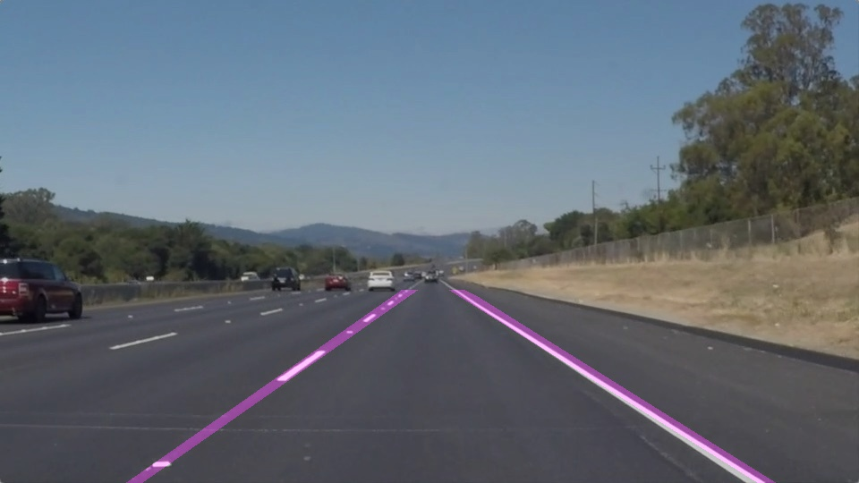

# **Finding Lane Lines on the Road** 

Overview
---

The project describes detecting lane lines from a camera image
as if mounted in a fixed position on an auto.
The image processing pipeline is developed in python
using 
[numpy](http://www.numpy.org/)
and 
[opencv](http://opencv.org/).
Given an image, lane lines are detected using Canny edge
detection and Hough transform.
Given a video clip, image processing pipeline is reused and 
the results are averaged for a time window.

Details
---

Project details are described in more detail in the
[writeup](https://github.com/selyunin/carnd_t1_p1/blob/master/writeup.md),
implementation in python notebook is available
[here](https://github.com/selyunin/carnd_t1_p1/blob/master/P1.ipynb).

