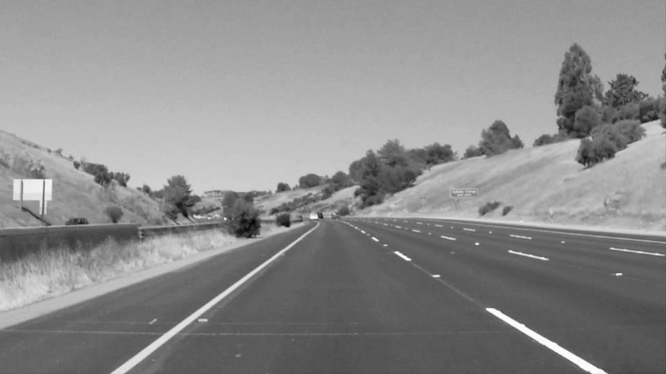
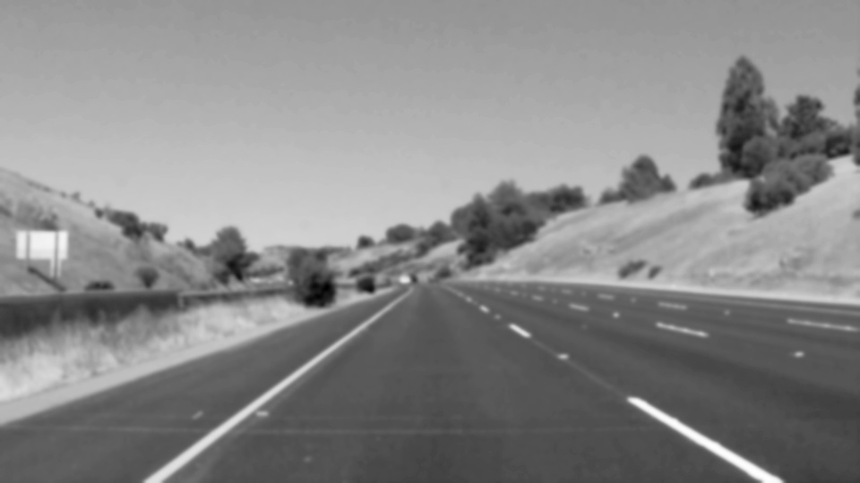
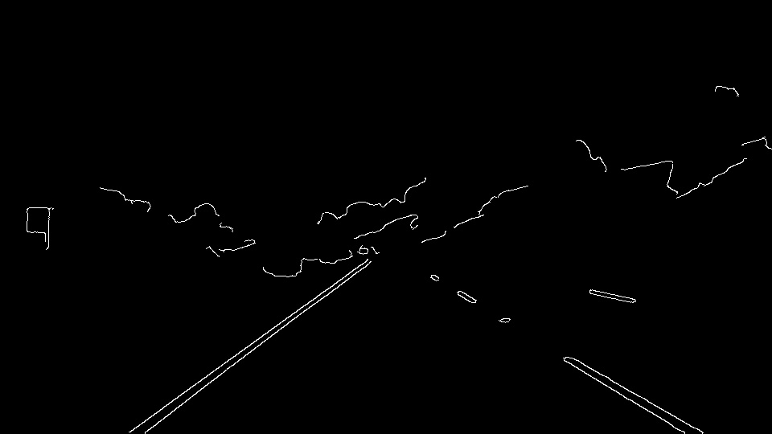
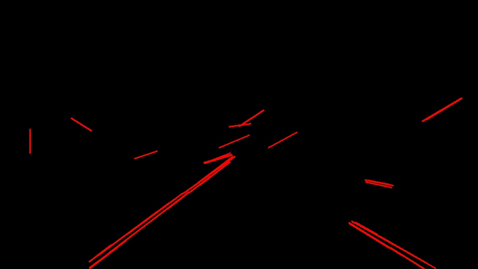
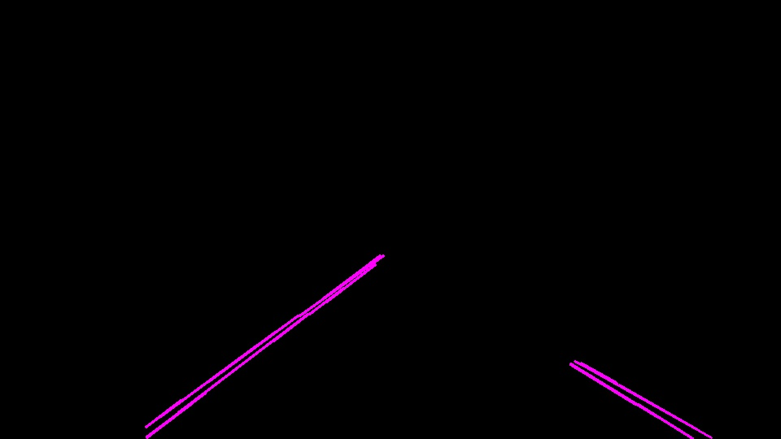
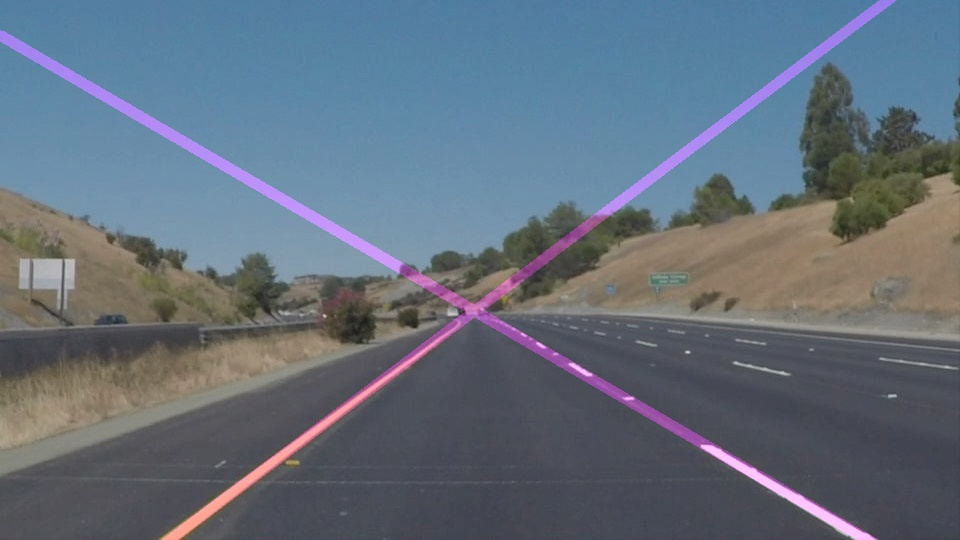

# **Finding Lane Lines on the Road** 

[//]: # (Image References)

[image1]: ./test_images_output/solidYellowCurve2_1.jpg "1_grayscale"
[image2]: ./test_images_output/solidYellowCurve2_2.jpg "2_blur"
[image3]: ./test_images_output/solidYellowCurve2_3.jpg "3_canny"
[image4]: ./test_images_output/solidYellowCurve2_4.jpg "4_hough"
[image4_2]: ./test_images_output/solidYellowCurve2_4_2.jpg "4_2_lane_segments"
[image5]: ./test_images_output/solidYellowCurve2_5.jpg "5_extrapolated"

---

### Reflection

### 1. Image processing pipeline description

The pipeline for detecting lane lines from camera images is described in function
`lane_detection_pipeline` in the python
[notebook](https://github.com/selyunin/carnd_t1_p1/blob/master/P1.ipynb)
and consists of the following steps 
(we describe functionality of the pipeline on the running example :

1) Converting original image to grayscale

2) Applying Gaussian blur to smoothen image gradients

3) Computing two-dimensional gradient using Canny edge detection

4) Detecting lines using Hough transform

5) Converting line segments to polar coordinates (for separation left and right lines)

6) Find left and right lane line and extrapolate these lines 

7) Draw extrapolated lines

8) Overlay extrapolated lines over the original image

![alt text][image1]

### 2. Potential shortcomings of the pipeline

### 3. Possible improvements to the pipeline

