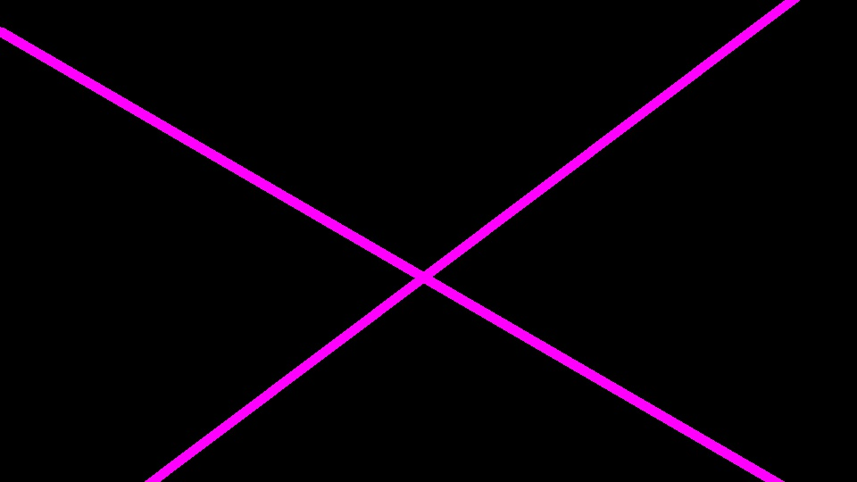

# **Finding Lane Lines on the Road** 

### Reflection

### 1. Image processing pipeline description

The pipeline for detecting lane lines from camera images is implemented in function
`lane_detection_pipeline` in the python
[notebook](https://github.com/selyunin/carnd_t1_p1/blob/master/P1.ipynb)
and comprises the steps described below
(we illustrate functionality of the pipeline on the running example `solidYellowCurve2.jpg`).

0) Given an original camera image (below) we proceed as follows:

1) Convert original image to greyscale

2) Apply Gaussian blur to smoothen image gradients

3) Compute two-dimensional gradient using Canny edge detection

4) Detect lines using Hough transform

6) Find lane lines segments: we test (function `find_lane_segments`) whether lines detected 
in the previous step intersect with a road approximating polyhedron (function `vertices_img_pipeline`).

5) Separate left and right lane lines: we convert lines to polar coordinates (function `polar_coord_line`), 
and separate segments based on angle. The figure below clearly depicts two clusters in polar
coordinates, that correspond to left and right lane segments.

7) Extrapolate left and right lane lines: We find average of separated left and right segments (`extrapolate_lane_segments`).

8) Apply vertices mask and overlay extrapolated lines over the original image

9) Apply pipeline to videos. When applied to videos, we identify time window 
(using fixed size `deque` from python's `collections` and average lines found in steps (1) - (8)
over this fixed size time window.

### 2. Potential shortcomings of the pipeline

First, straight line approximation is not optimal for roads with high curvature.
Second, simple separation in polar coordinates can be problematic.

### 3. Possible improvements to the pipeline

Initial pre-processing: try increase image contrast.
Approximate with curves, not straight lines.
Define weighted sum in polar coordinates based on length of the line segment.

### 4. Written by

[Konstantin Selyunin](http://selyunin.com/), for
suggestions/questions/comments please contact: 
selyunin [dot] k [dot] v [at] gmail [dot] com
